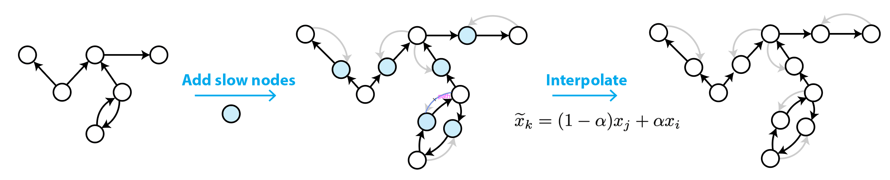
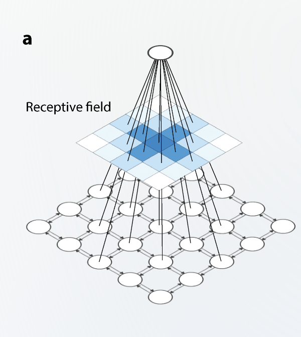
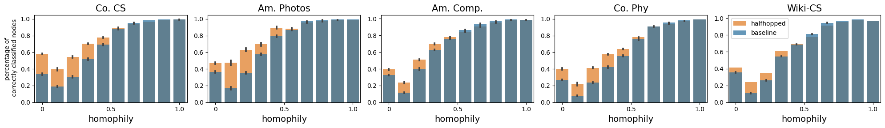

# Half-Hop
Official Implementation of [Half-Hop: A graph upsampling approach for slowing down message passing](https://openreview.net/forum?id=lXczFIwQkv) (ICML 2023)

## Contents
- [Introduction](#introduction)
- [Example usage](#example-usage)
- [Working](#working)
- [Slowing Receptive Field](#slowing-receptive-field)
- [Use case](#use-case)
- [Cite us](#cite-us)

---
### Introduction

Half-Hop is plug-and-play, and works with a wide range of datasets, architectures, and learning objectives!

Hafhop improves the effectiveness of Graph Neural Networks by slowing down the exponential message "smoothing" that is infamous in GNNs.




### Example usage:
```python3
from halfhop import HalfHop
# apply augmentation
transform = HalfHop(alpha=0.5)
data = transform(data)

# feedforward
y = model(data)

# get rid of slow nodes
y = y[~data.slow_node_mask]
```


### Working


To halfhop a directed edge, we basically introduce a new node that splits the edge into two. Due to the added hop, we refer to this new node as a ”slow node”.

Note that both the source and target nodes communicate
their messages to the slow node, but the slow node only
passes information in the original direction.

### Slowing Receptive Field

The receptive field (RF) of a model represents the parts of the input graph that have the most significant impact on the final embedding of a particular node.

When Half-Hop is applied, 1-hop neighbors become 2-hop neighbors and the receptive field is thus reduced since messages take longer to propagate as they are routed through slow nodes.

In the below image, we see the receptive field of the central node, with the intensity of the blue representing the strength of influence of the neighboring node to the central node. (Refer Fig. 2 a in the paper for more details)





After halfhop, we can see samples of the same receptive fields, but this time the same central node's receptive field preserves locality better, which helps reduce the oversmoothing effect. (Refer Fig. 2 d in the paper for more details)


### Use case

Halfhop is most effective when the graphs to be trained on are heterophillic. I.e, neighbors of an arbitrary node in the graph are less likely to share the same class/property that is to be predicted.

We can see the improvements in individual predictions as percentages in the below study (refer to our Fig. 4 in paper for more details) for various benchmarked datasets.



### Cite us

If you find the code useful for your research, please consider citing our work:
```
@article{azabou2023half,
  title={Half-Hop: A graph upsampling approach for slowing down message passing},
  author={Azabou, Mehdi and Ganesh, Venkataramana and Thakoor, Shantanu and Lin, Chi-Heng and Sathidevi, Lakshmi and Liu, Ran and Valko, Michal and Veli{\v{c}}kovi{\'c}, Petar and Dyer, Eva L},
  journal={Proceedings of the International Conference on Machine Learning (ICML)}
  year={2023}
}
```